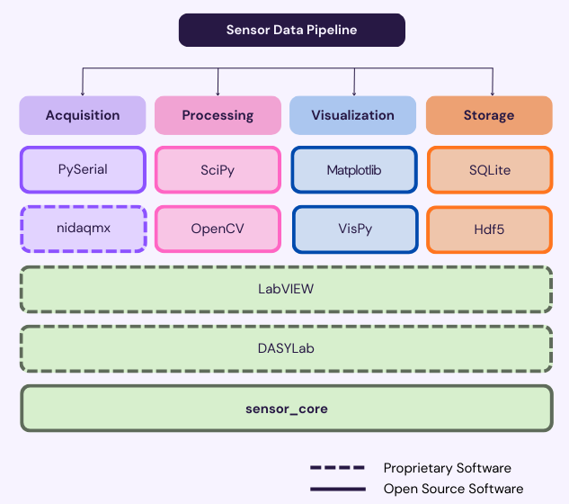
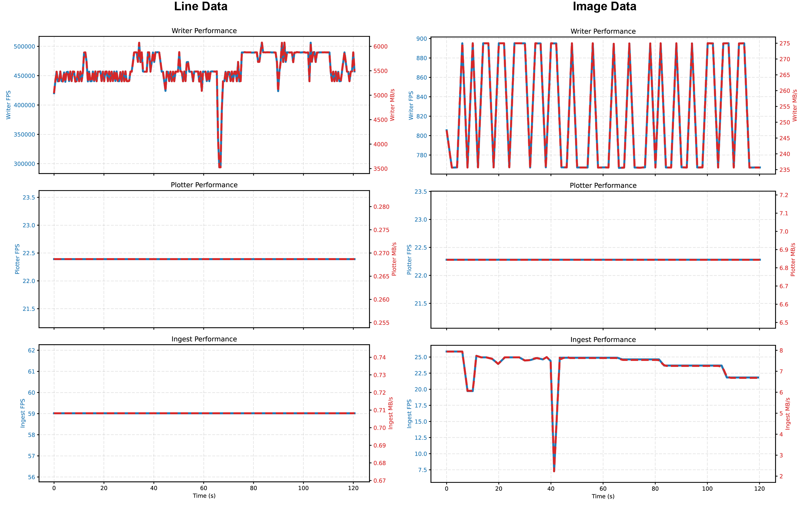

## Summary

sensor_core is an open-source software framework for real-time sensor data acquisition, visualization, processing, and storage designed to support custom and heterogeneous sensor streams. It provides a modular architecture that enables hardware-agnostic interfaces for sensor integration, streaming visualizations for immediate data assessment, configurable processing pipelines for digital filtering, and efficient storage backends for persistent data archiving. The framework emphasizes low-latency operation and extensibility, making it suitable for a broad subset of research applications.

## Statement of Need

Contemporary sensor-driven research—such as robotics, neuroscience, and medical devices—increasingly depends on the real-time collection and interpretation of high-frequency data streams. Many existing solutions are either proprietary, tied to specific hardware, or lack integrated real-time processing and visualization capabilities. This fragmentation creates barriers for researchers who need flexible, extensible, and open frameworks capable of supporting diverse sensors and experimental conditions.

sensor_core fills this gap by providing consolidated infrastructure for:

- Real-time acquisition of data from heterogeneous sensors with reliable time synchronization.
- Interactive visualization using fastplotlib to support exploratory analysis and monitoring workflows.
- Processing pipelines that allow custom digital signal processing within live streams.
- Persistent storage with schema-agnostic backends that facilitate reproducible downstream analysis.

The target audience includes researchers, engineers, and developers who require a lightweight but comprehensive foundation for building sensor-centric research systems. By abstracting common real-time concerns and providing extensible interfaces, sensor_core reduces the engineering overhead of custom integrations and fosters reproducible data workflows across domains.

## State of the field

Existing software frameworks, depicted in Figure 1, vary widely in scope and design:

- **Proprietary acquisition suites**, such as LabVIEW and DASYLab, often support full data pipeline functionality for specific vendor hardware but limit extensibility and introduce cost and licensing barriers.
- **Hardware-specific libraries**, such as nidaqmx, can provide high-fidelity support for specific vendor hardware but are not generalizable to other custom devices.
- **Feature-specific libraries**, such as PySerial, Matplotlib, and SQLite, offer reliable tools for individual pipeline components but do not independently support full custom sensor data management workflows.

sensor_core distinguishes itself by combining end-to-end pipeline support with a modular architecture that developers can adapt to novel sensor classes. Its real-time visualization and storage capabilities are embedded, eliminating the need for third-party tools for core pipeline elements. While default methods are available for data acquisition and processing, custom methods can be integrated into the pipeline to support broader generalizability.

**Figure 1:** Overview of the sensor_core data pipeline architecture and related tools.

## Software Design

sensor_core was designed under competing constraints common in real-time sensor research: low-latency data handling, hardware variability, and abstracted API accessibility. Existing Python-based tools often optimize for one of these features at the cost of the other - for example, providing a high-throughput acquisition for only specific hardware systems. sensor_core prioritizes low-latency data handling whiole retaining extensibility for multiple hardware platforms and accessibility for research use through the following mechanisms:

### Multiprocessing and Zero-Copy Buffer Transfers

Separate processes are instantiated to handle data acquisition, visualization, and storage, reducing latency and contention across tasks. With the exception of the plotting process, zero-copy buffer transfers are employed to minimize memory overhead and inter-process communication costs.

### Single-Producer Multiple-Consumer Circular Buffer

A single circular buffer is shared across processes with an enforced fixed lag between write and read pointers, eliminating the need for mutex locks on shared memory. The buffer is implemented in C++ for performance and accessed through a Python adaptor layer.

### Dual-Binary File Streaming

Although SQLite provides a lightweight and tabular storage format, appending high-frequency data can induce significant latency. To mitigate this, sensor_core streams data into one of two alternating binary files while a separate process asynchronously offloads data into a SQLite database. This approach minimizes storage-induced bottlenecks in the real-time pipeline.

sensor_core also leverages fastplotlib, a GPU-accelerated visualization library built on WGPU, to enable efficient rendering of both line-based and image-based sensor data streams.

**Figure 2:** Writer, plotter, and ingest performance for line and image data streams.

### Build vs Contribute Justification

While components of sensor_core overlap with existing projects - like PySerial for acquisition - no existing framework provides an integrated, low-latency, hardware-agnostic pipeline with real-time visualization and persistent storage. As such, contributing incremental features to each existing library would not address the fundamental architectural requirements to accomplish this, such as: shared-memory management, multi-process orchestration, and synchronized data ingestion. 

## Research Impact Statement

sensor_core has been used in multiple photoplethysmography-based applications, including pulse oximetry and near-infrared muscle tracking systems, to enable real-time medical device experimentation. These use cases demonstrate that sensor_core supports demanding real-time workloads while enabling reproducible and transparent research workflows.

Beyond these initial applications, performance benchmarks included with the repository demonstrate stable throughput for both line- and image-based data streams, validating its suitability for real-time workloads. The project is released under an open-source license, includes CI-based validation (for performing cross-platform builds and autmated smoke testing during release), example configurations within notebooks, and follows a modular design that lowers the barrier to integrating new sensor modalities within. 

By consolidating acquisition, visualization, processing, and storage into a single pipeline, sensor_core reduces the design overhead typically required to prototype and validate new sensor systems. This positions the software as a reusable research infrastructure component rather than a single-purpose application. 

## Acknowledgements

The authors acknowledge the contributions of collaborators and beta testers who provided valuable feedback during development. This work was supported by the North Carolina Biotechnology Translational Research Grant (NC Biotech TRG) and the 1789 Student Venture Fund at the University of North Carolina.

## AI Usage Disclosure

Generative AI tools were used to assist with drafting and editing portions of the manuscript and associated bibliography, as well as drafting the github workflow files used for CI validation. All software design, implementation, validation, and final editorial decisions were performed by the authors. 

## References
