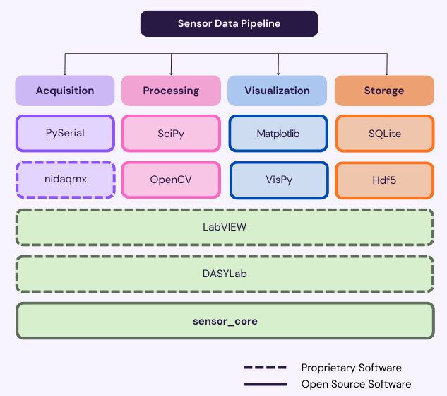

## Summary

sensor_core is an open-source software framework for real-time sensor data acquisition, visualization, processing, and storage designed to support custom and heterogeneous sensor streams. It provides a modular architecture that enables hardware-agnostic interfaces for sensor integration, streaming visualizations for immediate data assessment, configurable processing pipelines for digital filtering, and an efficient storage pipeline for persistent data archiving. The framework emphasizes low-latency operation and extensibility, making it suitable for a broad subset of research applications.

## Statement of Need

Contemporary sensor-driven research - such as robotics, neuroscience, and medical devices - increasingly depends on the real-time collection and interpretation of high-frequency data streams. Many existing solutions are either proprietary, tied to specific hardware, or lack integrated real-time processing and visualization capabilities. This fragmentation creates barriers for researchers who need flexible, extensible, and open frameworks capable of supporting diverse sensors and experimental conditions.

sensor_core fills this gap by providing consolidated infrastructure for:

- Real-time acquisition of data from heterogeneous sensors, with each frame timestamped when it is acquired, on a clock shared by every process on the host computer.
- Interactive visualization using fastplotlib [@fastplotlib] to support exploratory analysis and monitoring workflows.
- Processing pipelines that apply custom or built-in digital filters to live streams as they are displayed, without altering the stored data.
- Persistent storage in SQLite [@sqlite], in a documented format that any SQLite client can read, to facilitate reproducible downstream analysis.

The target audience includes researchers, engineers, and developers who require a lightweight but comprehensive foundation for building sensor-centric research systems. By abstracting common real-time concerns and providing extensible interfaces, sensor_core reduces the engineering overhead of custom integrations and fosters reproducible data workflows across domains.

## State of the field

Existing software frameworks, depicted in \autoref{fig:pipeline}, vary widely in scope and design:

- **Proprietary acquisition suites**, such as LabVIEW [@labview] and DASYLab [@dasylab], often support full data pipeline functionality for specific vendor hardware but limit extensibility and introduce cost and licensing barriers.
- **Hardware-specific libraries**, such as nidaqmx [@nidaqmx], can provide high-fidelity support for specific vendor hardware but are not generalizable to other custom devices.
- **Feature-specific libraries**, such as PySerial [@pyserial] for acquisition, SciPy [@scipy] and OpenCV [@opencv] for processing, Matplotlib [@matplotlib] and VisPy [@vispy] for visualization, and SQLite [@sqlite] and HDF5 [@hdf5] for storage, offer reliable tools for individual pipeline components but do not independently support full custom sensor data management workflows.

sensor_core distinguishes itself by combining end-to-end pipeline support with a modular architecture that developers can adapt to novel sensor classes. Its real-time visualization and storage capabilities are embedded, eliminating the need for third-party tools for core pipeline elements. While default methods are available for data acquisition and processing, custom methods can be integrated into the pipeline to support broader generalizability.

## Software Design

sensor_core was designed under competing constraints common in real-time sensor research: low-latency data handling, hardware variability, and abstracted API accessibility. Existing Python-based tools often optimize for one of these features at the cost of the others - for example, providing high-throughput acquisition for only specific hardware systems. sensor_core prioritizes low-latency data handling while retaining extensibility for multiple hardware platforms and accessibility for research use through the following mechanisms:

### Multiprocessing and Shared-Memory Transfers

Acquisition and storage run in separate processes (on Windows, acquisition runs in a thread), and the live plot is drawn in the user's own process, so neither storage nor plotting can stall acquisition. Frames move between processes through shared memory rather than pipes or queues: the acquisition process copies each frame once into a shared circular buffer, and the plot and the storage writer read it from there without serialization.

### Single-Producer Multiple-Consumer Circular Buffer

The producer copies each frame and its acquisition timestamp into the next slot of the circular buffer, then advances an atomic write index, ensuring it never waits for readers. The live plot reads a fixed number of frames behind the newest, so it never displays a frame that is being written. The storage writer copies frames directly from the buffer and then checks the write index to confirm that the producer did not overwrite them during the copy; frames that were overwritten are dropped and counted rather than stored damaged. No locks are needed. The buffer is implemented in C++ and bound to Python with pybind11 [@pybind11].

### Segmented Stream Files

Although SQLite provides a lightweight and tabular storage format, committing high-frequency data to it as it arrives can stall the pipeline. Instead, the storage writer appends frames to numbered segment files, sealing each segment after a few seconds or once it reaches a size limit, and a separate process stores each sealed segment in SQLite in a single transaction and then deletes it. Segments left behind by a crash are stored when the next session starts. The database holds a table of sessions, with each session's settings and clock reference, and a table of frames, each with its index, acquisition time, and raw data, so the data can be read without sensor_core.

sensor_core also leverages fastplotlib [@fastplotlib], a GPU-accelerated visualization library built on WGPU, to render both line-based and image-based sensor data streams. Filters for the live display, such as moving averages and Butterworth filters from SciPy [@scipy], change only what is shown.

The repository includes a benchmark that streams simulated data through the whole pipeline, counting the frames acquired, written to disk, stored in SQLite, and drawn by the live plot, and then checks that every stored frame arrived intact (\autoref{fig:benchmark}). On a computer with an AMD Ryzen AI MAX+ 395 processor and integrated Radeon 8060S graphics, running Linux, a line stream of 5,000 acquisitions per second (3 channels of 10 samples each, or 50,000 samples per second per channel) and an image stream of 200 frames per second (640 × 480 pixels, or 61 MB/s) were each sustained for two minutes while being plotted live. Every frame was stored intact and none were dropped, the backlog awaiting storage stayed bounded, and the plot held 60 frames per second. The commands that reproduce the figure are listed in `benchmarks/README.md`.

![Throughput of a line stream (left: 3 channels of 10 samples per acquisition, 5,000 acquisitions per second) and an image stream (right: 640 × 480 8-bit frames, 200 frames per second), each plotted live for 120 s. Top: frames per second acquired and written to disk, with the data rate on the right axis. Middle: frames acquired but not yet stored in SQLite, which rises as each segment fills and falls when it is stored. Bottom: frames per second drawn by the live plot. All 602,355 line acquisitions and 24,098 images were stored intact.\label{fig:benchmark}](benchmark.png)

### Build vs Contribute Justification

While components of sensor_core overlap with existing projects - like PySerial [@pyserial] for acquisition - no existing framework provides an integrated, low-latency, hardware-agnostic pipeline with real-time visualization and persistent storage. As such, contributing incremental features to each existing library would not address the fundamental architectural requirements to accomplish this, such as: shared-memory management, multi-process orchestration, and crash-safe data ingestion.

## Research Impact Statement

sensor_core has been used in multiple photoplethysmography-based applications, including pulse oximetry [@putcha2025skin] and near-infrared muscle tracking systems [@liu2024laryngeal], to enable real-time medical device experimentation. These use cases demonstrate that sensor_core supports demanding real-time workloads while enabling reproducible and transparent research workflows.

Beyond these initial applications, the benchmark included with the repository demonstrates stable throughput for both line- and image-based data streams (\autoref{fig:benchmark}). The project is released under the Apache 2.0 license; its automated tests run on Linux, macOS, and Windows for every change, and the example notebooks and benchmark are run automatically as well. Example notebooks demonstrate each workflow, and the modular design lowers the barrier to integrating new sensor modalities.

By consolidating acquisition, visualization, processing, and storage into a single pipeline, sensor_core reduces the design overhead typically required to prototype and validate new sensor systems. This positions the software as a reusable research infrastructure component rather than a single-purpose application.

## Acknowledgements

The authors acknowledge the contributions of collaborators and beta testers who provided valuable feedback during development. This work was supported by the North Carolina Biotechnology Translational Research Grant (NC Biotech TRG) and the 1789 Student Venture Fund at the University of North Carolina.

## AI Usage Disclosure

Generative AI tools were used to assist with drafting and editing portions of the manuscript and associated bibliography, as well as drafting the GitHub workflow files used for continuous integration. During the review, AI tools were also used to help write the test suite and the benchmark, example notebooks, and documentation. The authors directed this work and reviewed, tested, and approved every change, and all final design and editorial decisions were made by the authors.

## References
